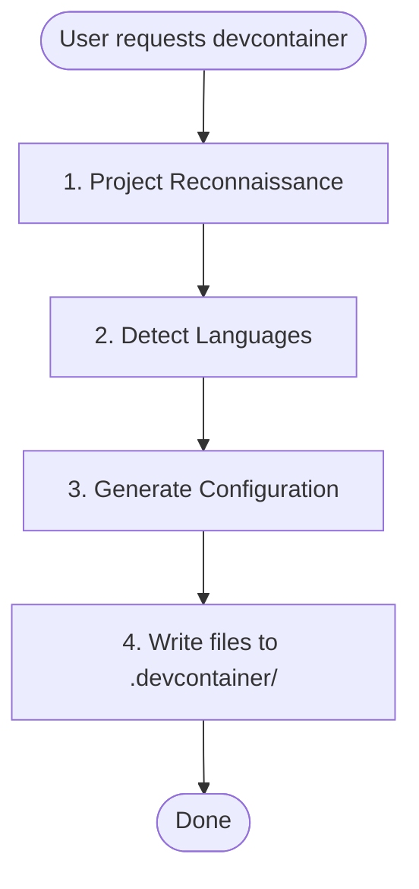

# Devcontainer Setup Skill

Creates a pre-configured devcontainer with language-specific tooling.

## When to Use

- User asks to "set up a devcontainer" or "add devcontainer support"
- User needs isolated development environments with persistent configuration

## When NOT to Use

- User already has a devcontainer configuration and just needs modifications
- User is asking about general Docker or container questions
- User wants to deploy production containers (this is for development only)

## Workflow



## Phase 1: Project Reconnaissance

### Infer Project Name

Check in order (use first match):

1. `package.json` → `name` field
2. `pyproject.toml` → `project.name`
3. `Cargo.toml` → `package.name`
4. `go.mod` → module path (last segment after `/`)
5. Directory name as fallback

Convert to slug: lowercase, replace spaces/underscores with hyphens.

### Detect Language Stack

| Language | Detection Files |
|----------|-----------------|
| Python | `pyproject.toml`, `*.py` |
| Node/TypeScript | `package.json`, `tsconfig.json` |
| Rust | `Cargo.toml` |
| Go | `go.mod`, `go.sum` |

### Multi-Language Projects

If multiple languages are detected, configure all of them in the following priority order:

1. **Python** - Primary language, uses Dockerfile for uv + Python installation
2. **Node/TypeScript** - Uses devcontainer feature
3. **Rust** - Uses devcontainer feature
4. **Go** - Uses devcontainer feature

For multi-language `postCreateCommand`, chain all setup commands:
```
uv sync && npm ci
```

Extensions and settings from all detected languages should be merged into the configuration.

## Phase 2: Generate Configuration

Start with base templates from the upstream plugin `resources/` directory. (see upstream Trail of Bits prodsec-skills for companion files) Substitute:

- `{{PROJECT_NAME}}` → Human-readable name (e.g., "My Project")
- `{{PROJECT_SLUG}}` → Slug for volumes (e.g., "my-project")

Then apply language-specific modifications below.

## Base Template Features

The base template includes:

- **Python 3.13** via uv (fast binary download)
- **Node 22** via fnm (Fast Node Manager)
- **ast-grep** for AST-based code search
- **Network isolation tools** (iptables, ipset) with NET_ADMIN capability
- **Modern CLI tools**: ripgrep, fd, fzf, tmux, git-delta

---

## Language-Specific Sections

### Python Projects

**Detection:** `pyproject.toml`, `requirements.txt`, `setup.py`, or `*.py` files

**Dockerfile additions:**

The base Dockerfile already includes Python 3.13 via uv. If a different version is required (detected from `pyproject.toml`), modify the Python installation:

```dockerfile
# Install Python via uv (fast binary download, not source compilation)
RUN uv python install <version> --default
```

**devcontainer.json extensions:**

Add to `customizations.vscode.extensions`:
```json
"ms-python.python",
"ms-python.vscode-pylance",
"charliermarsh.ruff"
```

Add to `customizations.vscode.settings`:
```json
"python.defaultInterpreterPath": ".venv/bin/python",
"[python]": {
  "editor.defaultFormatter": "charliermarsh.ruff",
  "editor.codeActionsOnSave": {
    "source.organizeImports": "explicit"
  }
}
```

**postCreateCommand:**
If `pyproject.toml` exists, chain commands:
```
rm -rf .venv && uv sync
```

---

### Node/TypeScript Projects

**Detection:** `package.json` or `tsconfig.json`

**No Dockerfile additions needed:** The base template includes Node 22 via fnm (Fast Node Manager).

**devcontainer.json extensions:**

Add to `customizations.vscode.extensions`:
```json
"dbaeumer.vscode-eslint",
"esbenp.prettier-vscode"
```

Add to `customizations.vscode.settings`:
```json
"editor.defaultFormatter": "esbenp.prettier-vscode",
"editor.codeActionsOnSave": {
  "source.fixAll.eslint": "explicit"
}
```

**postCreateCommand:**
Detect package manager from lockfile and chain with base command:
- `pnpm-lock.yaml` → `pnpm install --frozen-lockfile`
- `yarn.lock` → `yarn install --frozen-lockfile`
- `package-lock.json` → `npm ci`
- No lockfile → `npm install`

---

### Rust Projects

**Detection:** `Cargo.toml`

**Features to add:**

```json
"ghcr.io/devcontainers/features/rust:1": {}
```

**devcontainer.json extensions:**

Add to `customizations.vscode.extensions`:
```json
"rust-lang.rust-analyzer",
"tamasfe.even-better-toml"
```

Add to `customizations.vscode.settings`:
```json
"[rust]": {
  "editor.defaultFormatter": "rust-lang.rust-analyzer"
}
```

**postCreateCommand:**
If `Cargo.lock` exists, use locked builds:
```
cargo build --locked
```
If no lockfile, use standard build:
```
cargo build
```

---

### Go Projects

**Detection:** `go.mod`

**Features to add:**

```json
"ghcr.io/devcontainers/features/go:1": {
  "version": "latest"
}
```

**devcontainer.json extensions:**

Add to `customizations.vscode.extensions`:
```json
"golang.go"
```

Add to `customizations.vscode.settings`:
```json
"[go]": {
  "editor.defaultFormatter": "golang.go"
},
"go.useLanguageServer": true
```

**postCreateCommand:**
```
go mod download
```

---

## Adding Persistent Volumes

Pattern for new mounts in `devcontainer.json`:

```json
"mounts": [
  "source={{PROJECT_SLUG}}-<purpose>-${devcontainerId},target=<container-path>,type=volume"
]
```

Common additions:
- `source={{PROJECT_SLUG}}-cargo-${devcontainerId},target=/home/vscode/.cargo,type=volume` (Rust)
- `source={{PROJECT_SLUG}}-go-${devcontainerId},target=/home/vscode/go,type=volume` (Go)

---

## Output Files

Generate these files in the project's `.devcontainer/` directory:

1. `Dockerfile` - Container build instructions
2. `devcontainer.json` - VS Code/devcontainer configuration
3. `.zshrc` - Shell configuration
4. `install.sh` - CLI helper for managing the devcontainer (`devc` command)

---

## Validation Checklist

Before presenting files to the user, verify:

1. All `{{PROJECT_NAME}}` placeholders are replaced with the human-readable name
2. All `{{PROJECT_SLUG}}` placeholders are replaced with the slugified name
3. JSON syntax is valid in `devcontainer.json` (no trailing commas, proper nesting)
4. Language-specific extensions are added for all detected languages
5. `postCreateCommand` includes all required setup commands (chained with `&&`)

---

## User Instructions

After generating, inform the user:

1. How to start: "Open in VS Code and select 'Reopen in Container'"
2. Alternative: `devcontainer up --workspace-folder .`
3. CLI helper: Run `.devcontainer/install.sh self-install` to add the `devc` command to PATH

## Inlined reference material (upstream)

Companion docs from the Trail of Bits prodsec-skills `devcontainer-setup` plugin.

### Dockerfile best practices

# Dockerfile Best Practices

## Quick Reference

| Practice | Why |
|----------|-----|
| Order by change frequency | Rarely-changing layers first (base, system packages), frequently-changing last |
| Combine related RUN commands | Reduces layers and ensures cache coherence |
| Clean up in same layer | Don't leave apt cache in a layer |
| Use multi-stage builds | Separate build dependencies from runtime, reduce final image size |
| Pin versions with digests | Supply chain security: `FROM alpine:3.21@sha256:abc123...` |
| Switch to non-root user last | Do root operations first, then `USER vscode` |
| Use COPY over ADD | ADD has extra features you usually don't need |
| Use .dockerignore | Exclude build-irrelevant files to reduce context size |

## Base Image Selection

Choose minimal, trusted base images:
- **Docker Official Images** - curated, documented, regularly updated
- **Alpine Linux** - under 6 MB, tightly controlled
- **Verified Publisher** or **Docker-Sponsored Open Source** images

Pin images to specific digests for reproducible builds:
```dockerfile
FROM alpine:3.21@sha256:a8560b36e8b8210634f77d9f7f9efd7ffa463e380b75e2e74aff4511df3ef88c
```

Avoid `latest` tag - it can change unexpectedly and cause breaking builds.

## apt-get Best Practices

Always combine `update` with `install` in the same RUN statement:

```dockerfile
RUN apt-get update && apt-get install -y --no-install-recommends \
    curl \
    git \
    vim \
    && rm -rf /var/lib/apt/lists/*
```

**Why combine?** Keeping them separate causes Docker to cache the `update` layer, potentially installing outdated packages on subsequent builds.

**Best practices:**
- Use `--no-install-recommends` to minimize installed packages
- Sort packages alphabetically within each section for easier maintenance and PR reviews
- Clean up with `rm -rf /var/lib/apt/lists/*` in the same layer

## Pipe Safety

When using pipes, prepend `set -o pipefail &&` to fail if any command fails:

```dockerfile
RUN set -o pipefail && curl -fsSL https://example.com/install.sh | bash
```

Without this, a failed `curl` would be masked by a successful `bash`.

## Environment Variables

Use `ENV` for paths, versions, and configuration:

```dockerfile
ENV PYTHON_VERSION=3.13
ENV PATH=/home/vscode/.local/bin:$PATH
```

Note: `ENV` instructions add metadata, not filesystem layers like `RUN`. Multiple separate `ENV` lines are fine and often more readable than combining them.

## WORKDIR

Always use absolute paths. Avoid `RUN cd ... && command` patterns:

```dockerfile
# Good
WORKDIR /app
RUN make install

# Bad
RUN cd /app && make install
```

## Architecture Support

The templates support both AMD64 and ARM64 (Apple Silicon) automatically. Use `TARGETARCH` build arg for architecture-specific downloads:

```dockerfile
ARG TARGETARCH
RUN curl -fsSL "https://example.com/tool-${TARGETARCH}.tar.gz" | tar xz
```

## Devcontainer-Specific Tips

**Resource allocation:** Docker Desktop has limited defaults. Increase CPU/Memory in Docker settings for resource-intensive builds.
**Windows/WSL2:** Use Docker Desktop's WSL 2 backend for better file sharing performance.

## Sources

- [Docker Build Best Practices](https://docs.docker.com/build/building/best-practices/)
- [VS Code Dev Containers Tips](https://code.visualstudio.com/docs/devcontainers/tips-and-tricks)


### Features vs Dockerfile

# Features vs Dockerfile

## Use devcontainer features when:

- Installing standard development tools (GitHub CLI, languages, etc.)
- The feature does what you need out of the box
- You want automatic updates with feature version bumps

## Use Dockerfile when:

- Installing specific versions of tools
- Custom configuration is needed
- Combining multiple tools in optimized layers
- The feature doesn't exist or is poorly maintained

## Example: Python

For Python, we use Dockerfile + uv instead of the Python feature because:

1. uv installs Python binaries instantly (vs compiling from source)
2. We get uv for dependency management
3. More control over the installation

